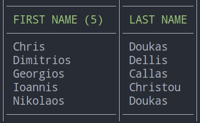

# TablePrinter

_tableprinter_ is an intelligent value-to-table formatter and writer. It uses a customized version of [olekukonko/tablewriter](https://github.com/kataras/tablewriter) to render a result table.



It checks every in data and transforms those data(structure values, slices, maps, single lists that may contain different type of values such as go standard values like `int`, `string` even a value that implements the `fmt.Stringer` interface) to a table formatted text and outputs it to an `io.Writer`. Like `encoding/json#Encode` but for tables.

[](https://travis-ci.org/Landoop/tableprinter) [](http://goreportcard.com/report/Landoop/tableprinter) [](https://godoc.org/github.com/Landoop/tableprinter)
[](https://github.com/Landoop/tableprinter/tree/master/_examples)

## Installation

The only requirement is the [Go Programming Language](https://golang.org/dl), at least version **1.10**.

```sh
$ go get -u github.com/landoop/tableprinter
```

```go
package main

import (
    "os"
    "sort"

    "github.com/kataras/tablewriter"
    "github.com/landoop/tableprinter"
)

type person struct {
    Firstname string `header:"first name"`
    Lastname  string `header:"last name"`
}

func main() {
    printer := tableprinter.New(os.Stdout)
    persons := []person{
        {"Chris", "Doukas"},
        {"Georgios", "Callas"},
        {"Ioannis", "Christou"},
        {"Nikolaos", "Doukas"},
        {"Dimitrios", "Dellis"},
    }

    sort.Slice(persons, func(i, j int) bool {
        return persons[j].Firstname > persons[i].Firstname
    })

    // Optionally, customize the table, import of the underline 'tablewriter' package is required for that.
    printer.BorderTop, printer.BorderBottom, printer.BorderLeft, printer.BorderRight = true, true, true, true
    printer.CenterSeparator = "│"
    printer.ColumnSeparator = "│"
    printer.RowSeparator = "─"
    printer.HeaderBgColor = tablewriter.BgBlackColor
    printer.HeaderFgColor = tablewriter.FgGreenColor

    // Print the slice of structs as table, as shown above.
    printer.Print(persons)
}
```

### Examples

* [Simple](/_examples/1_simple/main.go)
* [Inline](/_examples/2_inline/main.go)
* [List](/_examples/3_list/main.go)
* [Map](/_examples/4_map/main.go)
* [Struct](/_examples/5_struct/main.go)
* [Manually render a row](/_examples/6_custom_render_row/main.go)
* [JSON](/_examples/7_json_bytes/main.go)
* [Filter output rows](/_examples/8_filters/main.go)
* [Customize the table looking](/_examples/9_customize/main.go)

## Versioning

Current: **v0.0.3**

Read more about Semantic Versioning 2.0.0

- http://semver.org/
- https://en.wikipedia.org/wiki/Software_versioning
- https://wiki.debian.org/UpstreamGuide#Releases_and_Versions

## License

Distributed under Apache Version 2.0, see [LICENSE](LICENSE) for more information.
